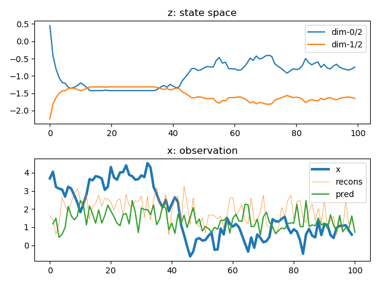
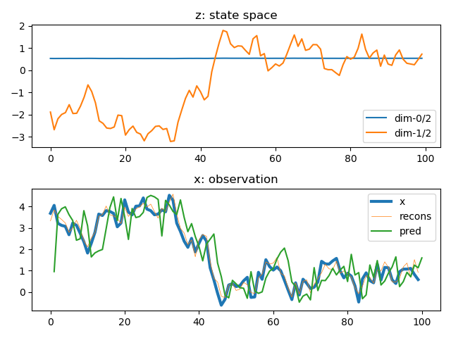

| alpha |beta|ex0|ex1|ex2|
|      -|   -| -| -| -| -| -| -| -| -|  -|
|0.1|0.1| | | |
|0.1|0.2| | | |
|0.1|0.3| | | |
|0.1|0.4| | | |
|0.1|0.5| | | |
|0.1|0.6| | | |
|0.1|0.7| | | |
|0.1|0.8| | | |
|0.1|0.9| | | |
|0.1|1| | | |
|0.2|0.1| | | |
|0.2|0.2| | | |
|0.2|0.3| | | |
|0.2|0.4| | | |
|0.2|0.5| | | |
|0.2|0.6| | | |
|0.2|0.7| | | |
|0.2|0.8| | | |
|0.2|0.9| | | |
|0.2|1| | | |
|0.3|0.1| | | |
|0.3|0.2| | | |
|0.3|0.3| | | |
|0.3|0.4| | | |
|0.3|0.5| | | |
|0.3|0.6| | | |
|0.3|0.7| | | |
|0.3|0.8| | | |
|0.3|0.9| | | |
|0.3|1| | | |
|0.4|0.1| | | |
|0.4|0.2| | | |
|0.4|0.3| | | |
|0.4|0.4| | | |
|0.4|0.5| | | |
|0.4|0.6| | | |
|0.4|0.7| | | |
|0.4|0.8| | | |
|0.4|0.9| | | |
|0.4|1| | | |
|0.5|0.1| | | |
|0.5|0.2| | | |
|0.5|0.3| | | |
|0.5|0.4| | | |
|0.5|0.5| | | |
|0.5|0.6| | | |
|0.5|0.7| | | |
|0.5|0.8| | | |
|0.5|0.9| | | |
|0.5|1| | | |
|0.6|0.1| | | |
|0.6|0.2| | | |
|0.6|0.3| | | |
|0.6|0.4| | | |
|0.6|0.5| | | |
|0.6|0.6| | | |
|0.6|0.7| | | |
|0.6|0.8| | | |
|0.6|0.9| | | |
|0.6|1| | | |
|0.7|0.1| | | |
|0.7|0.2| | | |
|0.7|0.3| | | |
|0.7|0.4| | | |
|0.7|0.5| | | |
|0.7|0.6| | | |
|0.7|0.7| | | |
|0.7|0.8| | | |
|0.7|0.9| | | |
|0.7|1| | | |
|0.8|0.1| | | |
|0.8|0.2| | | |
|0.8|0.3| | | |
|0.8|0.4| | | |
|0.8|0.5| | | |
|0.8|0.6| | | |
|0.8|0.7| | | |
|0.8|0.8| | | |
|0.8|0.9| | | |
|0.8|1| | | |
|0.9|0.1| | | |
|0.9|0.2| | | |
|0.9|0.3| | | |
|0.9|0.4| | | |
|0.9|0.5| | | |
|0.9|0.6| | | |
|0.9|0.7| | | |
|0.9|0.8| | | |
|0.9|0.9| | | |
|0.9|1| | | |
|1|0.1| | | |
|1|0.2| | | |
|1|0.3| | | |
|1|0.4| | | |
|1|0.5| | | |
|1|0.6| | | |
|1|0.7| | | |
|1|0.8| | | |
|1|0.9| | | |
|1|1| | | |
